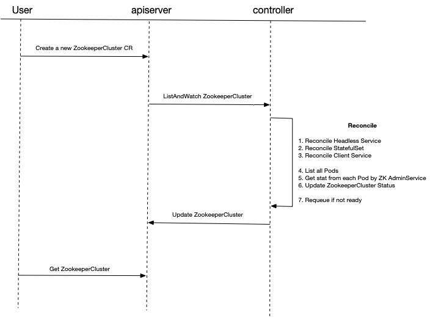

# Design of Zookeeper Operator

From our product requirements, the most important part is how to sync Zookeeper stats into CR Status. 
There are two solutions we've figured out:

- Solution#1: Sync Zookeeper stats inside the `Reconcile` directly
- Solution#2: Separate the sync stats action into a Sidecar controller

The `Solution#1` has been implemented currently. We'll do more in-depth analysis next.

## Solution#1
According to current design and implementation, the below diagram illustrates entire request sequence.



The reconciliation strategy for resources is creating if no exist. The zookeeper stats will be sync into `.status.nodes`, which is a map, the key is node ip and value is node role.

We stop requeue by comparing the actual and number of Pods, the number of `.status.nodes` with the desired replicas. 

### Pros & Cons
Pros:

- Simple implementation. We can put everything in a single `Reconcile` 
- Easy understanding and we can make sure the CR status

Cons:

- High delay. Request the zookeeper stats can be time consuming if there are many replica Pods
- Blocking operation. Other operations like update on this CR can be blocked if there are failed sync stats action 


## FAQ
### How to get Zookeeper stats from a Pod?
By Zookeeper AdminService. We can request the `http://{podIP}:8080/commands/stat`, then we will get below response:

```json
{
  "version" : "3.7.0-e3704b390a6697bfdf4b0bef79e3da7a4f6bac4b, built on 2021-03-17 09:46 UTC",
  "read_only" : false,
  "server_stats" : {
    "packets_sent" : 0,
    "packets_received" : 0,
    "fsync_threshold_exceed_count" : 0,
    "client_response_stats" : {
      "last_buffer_size" : -1,
      "min_buffer_size" : -1,
      "max_buffer_size" : -1
    },
    "server_state" : "standalone",
    "provider_null" : false,
    "data_dir_size" : 0,
    "log_dir_size" : 457,
    "last_processed_zxid" : 0,
    "outstanding_requests" : 0,
    "avg_latency" : 0.0,
    "max_latency" : 0,
    "min_latency" : 0,
    "num_alive_client_connections" : 0,
    "auth_failed_count" : 0,
    "non_mtlsremote_conn_count" : 0,
    "non_mtlslocal_conn_count" : 0,
    "uptime" : 212790
  },
  "client_response" : {
    "last_buffer_size" : -1,
    "min_buffer_size" : -1,
    "max_buffer_size" : -1
  },
  "node_count" : 5,
  "connections" : [ ],
  "secure_connections" : [ ],
  "command" : "stats",
  "error" : null
}
```


# References

- Running Zookeeper on Kubernetes, https://kubernetes.io/docs/tutorials/stateful-application/zookeeper/
- ZooKeeper Administrator's Guide, https://zookeeper.apache.org/doc/r3.7.0/zookeeperAdmin.html