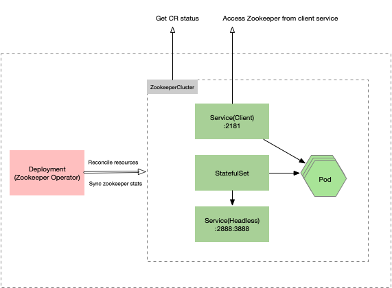
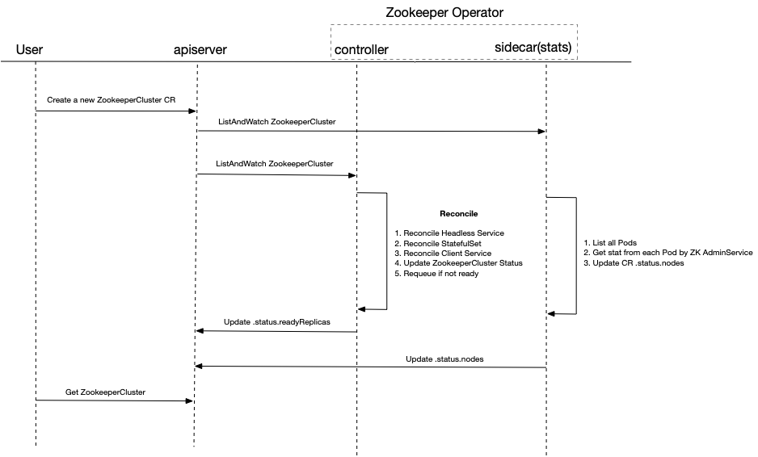

# Design of Zookeeper Operator

This document describes the architecture and core design of this Zookeeper Operator. 

## Architecture

We use `Zookeeper Operator` to manage the full lifecycle of a Zookeeper cluster. As also shown below, the operator manages cluster via `StatefulSet`.



Let's use an example to demonstrate how the Zookeeper Operator works for the case when user creates a Zookeeper Cluster:

- Operator creates a headless Service, which will be used in the StatefulSet internally
- Operator creates a StatefulSet, which `.spec.replicas` is the same as CR
- Operator creates a client Service, which type is `NodePort` and port mapping to `2181`. This is used to expose the Zookeeper service to external users
- Operator updates the `.status.readyReplicas` of CR, which is the number of ready servers
- Operator syncs Zookeeper stats into `.status.servers` of CR

We can notice that the most important part is how to sync Zookeeper stats into CR Status.
There are two solutions we've figured out:

- Solution#1: Sync Zookeeper stats inside the `Reconcile` directly
- Solution#2: Separate the sync stats action into a Sidecar controller

The `Solution#1` has been implemented currently. We'll do more in-depth analysis next.

## Solution#1
According to current design and implementation, the below diagram illustrates entire request sequence.


The reconciliation strategy for resources is creating if no exist. The zookeeper stats will be sync into `.status.servers`, which is a map, the key is server role and value is server state.

We stop requeue by comparing the actual and number of Pods, the size of `.status.servers` with the desired replicas. So we can say the cluster is ready when all servers respond stats successfully.

### Pros & Cons
Pros:

- Simple implementation. We can put everything in a single `Reconcile` 
- Easy understanding and we can make sure the CR status

Cons:

- High delay. Request the zookeeper stats can be time consuming if there are many replica Pods
- Blocking operation. Other operations like update on this CR can be blocked if there are failed sync stats action

But we can avoid these two cons via concurrent request and fast return. For the concurrent request, we can start a single goroutine for each Pod. 
For the fast return, we can run a pre-check function before each requeue, so we can return reconcile this time if pre-check received a new event.

## Solution#2

We put the sync stats in another sidecar container as shows below:



### Pros & Cons
Pros:

- Asynchronous operation. Decouple the status and stats will not block the main control loop

Cons:

- No guarantee stats, as the sync stats action is asynchronous with the main controller

## FAQ
### How to get Zookeeper stats from a Pod?
By Zookeeper AdminService. We can request the `http://{podIP}:8080/commands/stat`, then we will get below response:

```json
{
  "version" : "3.7.0-e3704b390a6697bfdf4b0bef79e3da7a4f6bac4b, built on 2021-03-17 09:46 UTC",
  "read_only" : false,
  "server_stats" : {
    "packets_sent" : 0,
    "packets_received" : 0,
    "fsync_threshold_exceed_count" : 0,
    "client_response_stats" : {
      "last_buffer_size" : -1,
      "min_buffer_size" : -1,
      "max_buffer_size" : -1
    },
    "server_state" : "standalone",
    "provider_null" : false,
    "data_dir_size" : 0,
    "log_dir_size" : 457,
    "last_processed_zxid" : 0,
    "outstanding_requests" : 0,
    "avg_latency" : 0.0,
    "max_latency" : 0,
    "min_latency" : 0,
    "num_alive_client_connections" : 0,
    "auth_failed_count" : 0,
    "non_mtlsremote_conn_count" : 0,
    "non_mtlslocal_conn_count" : 0,
    "uptime" : 212790
  },
  "client_response" : {
    "last_buffer_size" : -1,
    "min_buffer_size" : -1,
    "max_buffer_size" : -1
  },
  "node_count" : 5,
  "connections" : [ ],
  "secure_connections" : [ ],
  "command" : "stats",
  "error" : null
}
```

The `.server_stats.server_state` indicates the role of this node in the Zookeeper cluster, which value can be `leader`, `follower`, or `standalone`.

We'll get below response when the cluster is not ready yet: 

```json
{
  "command" : "stat",
  "error" : "This ZooKeeper instance is not currently serving requests"
}
```

# References

- Operator pattern, https://kubernetes.io/docs/concepts/extend-kubernetes/operator/
- Running Zookeeper on Kubernetes, https://kubernetes.io/docs/tutorials/stateful-application/zookeeper/
- Kubebuilder Documentation, https://book.kubebuilder.io/
- ZooKeeper Administrator's Guide, https://zookeeper.apache.org/doc/r3.7.0/zookeeperAdmin.html
- Zookeeper Official Image: https://hub.docker.com/_/zookeeper